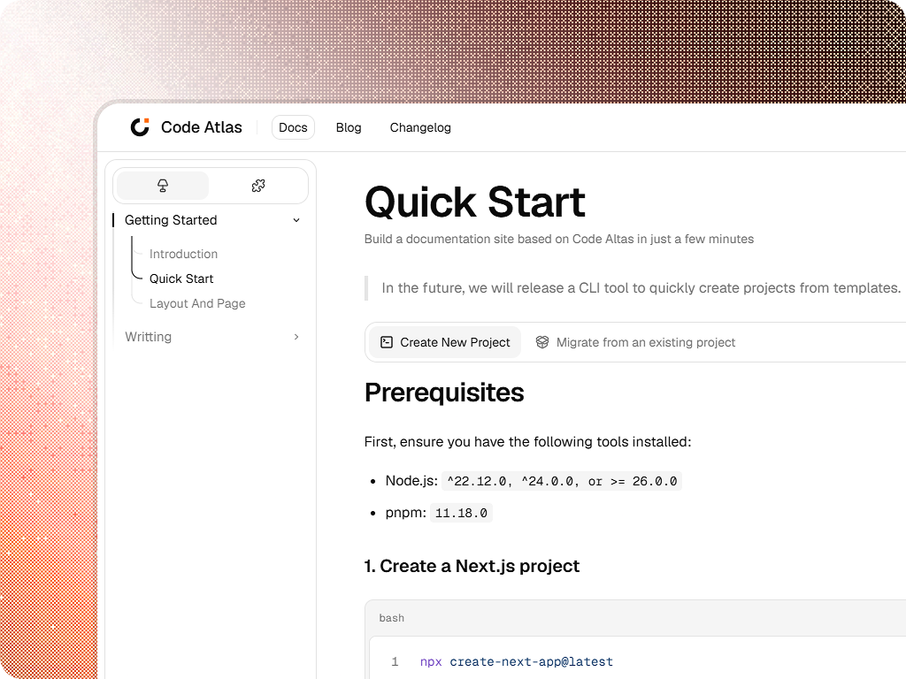

# Code Altas

**Documentation, built your way.**

Code Altas is a free, open-source documentation framework for Next.js. Write in
Markdown and MDX, publish guides and changelogs, and keep your content, design,
and deployment in your own hands.

[Get started](apps/web/content/index/quickstart.mdx) ·
[Explore the components](packages/ui/README.md) ·
[npm package](https://www.npmjs.com/package/@code-altas/ui) ·
[Report an issue](https://github.com/overl0ad1ng/code-altas/issues)



## Why Code Altas?

Documentation belongs alongside the product it explains. Code Altas brings the
reading experience, navigation, and authoring tools into your Next.js project,
so you can build a documentation site that feels like part of your product.

### Your content, in your repository

Keep guides and release notes as plain files. Review changes through pull
requests, track their history in Git, and use the editor and workflow your team
already knows.

### Your site, on your infrastructure

Deployment is decentralized: each site runs in its own Next.js application on
compatible Node.js hosting. You choose where it runs and how it is maintained;
there is no central Code Altas service to depend on.

### Your application, on your terms

Add documentation to an existing product or create a dedicated site. Compose
the layouts and pages you need, choose your routes, and bring your own React
components. Code Altas provides the documentation building blocks while you
retain control of the application.

### Free and open source

Code Altas is [MIT licensed](LICENSE). Use it for personal projects, open-source
communities, or commercial products. Read the source, adapt it, and contribute
improvements. The framework requires no subscription.

## What can you build?

- **Product documentation.** Organize guides with nested navigation, an article
  table of contents, and previous/next links.
- **Interactive guides.** Combine Markdown with tabs, steps, file trees, and
  custom React components through MDX.
- **Developer references.** Present highlighted code blocks with copy controls,
  tables, and structured component properties.
- **Release notes.** Publish a changelog from a single MDX file, with formatted
  dates and tags colored through your site configuration.

Shared branding, light and dark themes, and configurable navigation help these
pages feel like one site.

## How to use

### 1. Add Code Altas to your project

Start with a Next.js App Router application, or use one you already have:

```bash
pnpm add @code-altas/ui@beta
```

The current release is **0.1.0-beta**. It supports Node.js 22.12+, Next.js
16.3.6+ within 16.x, and React / React DOM 19.2.8+ within 19.x.

### 2. Make it your own

Set your site's name, branding, and document navigation in `codealtas.config.ts`.
Add the documentation layouts and pages to your routes. The package includes
compiled styles, so Tailwind is optional for your own interface.

Follow the [installation guide](packages/ui/README.md#configure-your-app) for a
complete setup, or read the [Quick Start](apps/web/content/index/quickstart.mdx).

### 3. Write and publish

Write Markdown or MDX under your app's `content/` directory. Add
`content/changelog.mdx` when you want to publish release notes. Commit your
content and deploy the application to your chosen Node.js hosting environment.

For folder structure and URL conventions, see the
[file conventions guide](apps/web/content/index/concepts/filesystem.mdx).

## Beta

Code Altas is ready for early adopters. APIs and styling may change between
prereleases; pin an exact version when you need reproducible deployments.
We welcome feedback from teams building real documentation sites.

## Contributing

[Share a bug or feature request](https://github.com/overl0ad1ng/code-altas/issues),
improve the documentation, or open a pull request. For local development, clone
this repository and run:

```bash
pnpm install
pnpm dev
```

Package development and release instructions live in the
[UI package README](packages/ui/README.md#maintainer-release-workflow).

## License

[MIT](LICENSE) © 2026 IzayoiKyomu
