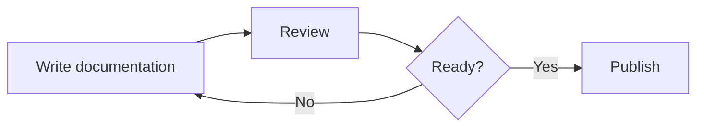
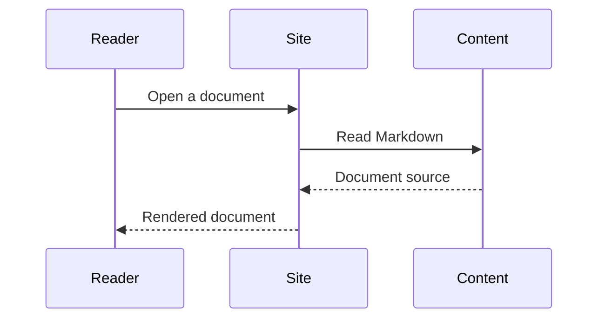
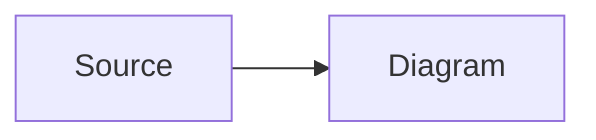

<Status since="0.1.8" />

Mermaid turns text into diagrams. Use a code fence with the `mermaid` language in any `.md` or `.mdx` document. Code Atlas renders it as a diagram instead of a highlighted code block. No imports or experimental flags are required.

## Flowcharts

Write the diagram inside a Mermaid fence:

````md

````

The result:


## Sequence diagrams

Use Mermaid's native syntax for other diagram types, such as a sequence diagram:



## Titles and copying

Add `title="..."` after the language to label a diagram, just as you would with a code block. Without a title, the label is `mermaid`. The copy button copies the Mermaid source, so it can be pasted into another document or the [Mermaid Live Editor](https://mermaid.live/).

Diagrams load in the browser. Invalid syntax displays an error within the diagram view while the rest of the document remains available.

## Diagrams in CodeGroup

A Mermaid fence can share a `CodeGroup` with ordinary code fences. Each diagram appears in its own tab:

<CodeGroup>



```text title="Source"
flowchart LR
  Source --> Diagram
```

</CodeGroup>

`CodeDiff` compares source code and does not accept Mermaid diagrams. Use `text` fences when you want to compare Mermaid source.

## Appearance

Diagrams use Mermaid's native `default` theme on a light canvas, including when the website is in dark mode. Site-level theme customization, zoom controls, and SVG downloads are not included in this version.

For more diagram types and syntax, see the [Mermaid documentation](https://mermaid.js.org/intro/).
