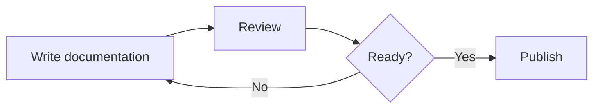
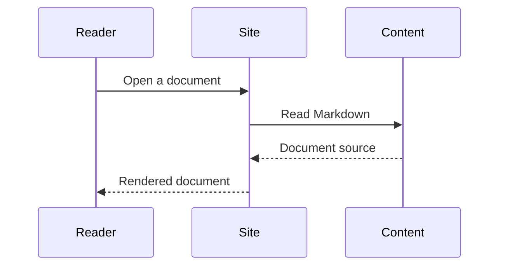
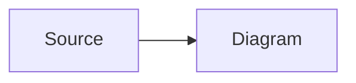

<Status since="0.1.8" />

Mermaid 可以把文本转换为图表。在任意 `.md` 或 `.mdx` 文档中，使用语言标记为 `mermaid` 的代码围栏即可。Code Atlas 会将其渲染为图表，而不是高亮代码块。无需导入任何内容，也无需启用实验性标志。

## 流程图

在 Mermaid 围栏内编写图表：

````md

````

渲染结果：


## 时序图

其他图表类型（例如时序图）可直接使用 Mermaid 的原生语法：



## 标题与复制

在语言标记后添加 `title="..."` 可以为图表添加标签，就像代码块一样。如果没有标题，标签默认为 `mermaid`。复制按钮会复制 Mermaid 源码，因此可以粘贴到其他文档或 [Mermaid Live Editor](https://mermaid.live/) 中。

图表在浏览器中加载。语法无效时会在图表视图中显示错误，而文档的其余部分仍然可用。

## CodeGroup 中的图表

Mermaid 围栏可以与普通代码围栏共享同一个 `CodeGroup`。每个图表都会显示在自己的标签页中：

<CodeGroup>



```text title="Source"
flowchart LR
  Source --> Diagram
```

</CodeGroup>

`CodeDiff` 用于比较源代码，不接受 Mermaid 图表。如果你想比较 Mermaid 源码，请使用 `text` 围栏。

## 外观

图表使用 Mermaid 原生的 `default` 主题并显示在浅色画布上，即使网站处于深色模式也是如此。此版本不包含站点级主题自定义、缩放控件和 SVG 下载功能。

更多图表类型和语法请参阅 [Mermaid documentation](https://mermaid.js.org/intro/)。
